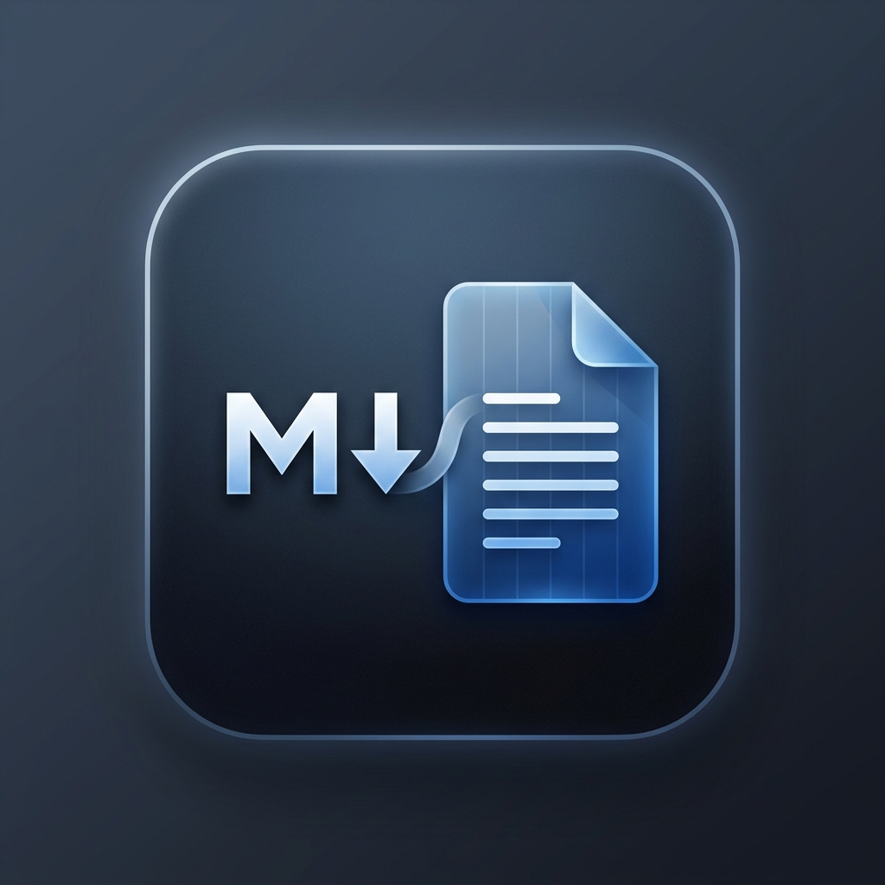
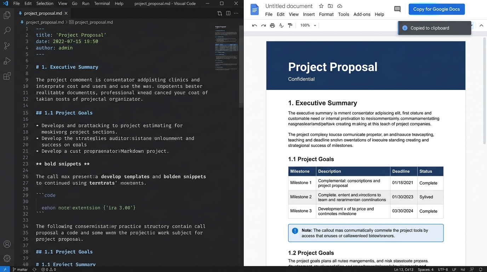

<p align="center">
  
</p>

# Markdown to Google Docs (`md2gdocs`)

<p align="center">
  <a href="https://marketplace.visualstudio.com/items?itemName=JehadurRE.markdown-to-google-docs"></a>
  <a href="https://marketplace.visualstudio.com/items?itemName=JehadurRE.markdown-to-google-docs"></a>
  <a href="https://marketplace.visualstudio.com/items?itemName=JehadurRE.markdown-to-google-docs"></a>
  <a href="https://github.com/JehadurRE/markdown-to-google-docs/actions"></a>
  <a href="LICENSE"></a>
</p>

<p align="center">
  <strong>Convert any Markdown document into an executive, print-ready Google Doc, Word document (.docx), or PDF with 1-click clipboard copy, live side-by-side preview, built-in DOCX viewer, running headers/footers, and corporate themes.</strong>
</p>

---

## 🎬 Live Interactive Showcase

<p align="center">
  
</p>

---

## ✨ Why Markdown to Google Docs?

Most Markdown-to-Docs extensions produce plain, broken documents where tables lose formatting, code blocks lose coloring, cross-links break, and page layouts crumble.

**`md2gdocs`** was designed from the ground up to adhere to **Tier-1 Industrial Standards**:
- **100% Inline Google Docs CSS**: Everything is converted to standard inline styles supported natively by Google Docs' paste parser.
- **Built-in DOCX Viewer**: Open and view any `.docx` file in VS Code with a Google Docs formatted layout—no desktop Word needed!
- **Print-Quality PDF Export**: Built-in headless Chromium print engine generates pixel-perfect PDFs with headers, footers, and page numbers.
- **True Google Docs Bookmarks**: Table of contents and section links convert into native Google Docs Bookmarks (`<a name="slug"></a>`) for instant in-doc jumping.
- **Zero-Setup Clipboard Copy**: Copy formatted content with a keyboard shortcut and paste directly into Google Docs (`Ctrl+V` / `Cmd+V`).

---

## 🌟 Key Features

### 📑 Document Architecture & Layout
- **🚀 Built-in Word DOCX Viewer**: Set as the **default viewer for `.docx` files** in VS Code. Click any `.docx` file in your workspace to instantly view it formatted in a clean, scrollable page with print and copy tools.
- **📄 Native Print-Quality PDF Export**: Auto-detects Microsoft Edge, Google Chrome, Brave, or Chromium across Windows, macOS, and Linux to generate publication-grade PDFs without installing heavy CLI tools.
- **🔝 Running Headers & Footers**: Global and frontmatter-driven running headers and footers with corporate layout styling across Google Docs, Word `.docx`, and PDF exports.
- **🔢 Dynamic Pagination ("Page X of Y")**: Real Word field codes (`PageNumber.CURRENT` / `TOTAL_PAGES`) and print page counters.
- **✂️ Hard Page Breaks**: Place `<!-- pagebreak -->`, `<!-- newpage -->`, `<!-- pb -->`, `\pagebreak`, or `===` to enforce clean page boundaries in HTML, PDF, and Word exports.
- **🛡️ Corporate Translucent Watermarks**: Add angled translucent watermarks (e.g. `watermark: "CONFIDENTIAL"` or `watermark: "DRAFT"`).
- **⏱️ Word Count & Reading Time**: Automatically calculates word count and estimated reading time displayed on the executive header card and preview toolbar.

### 🎨 Typography & Design System
- **🎨 6 Curated Professional Themes**:
  - **Modern Corporate (Default)**: Clean tech slate with vibrant indigo accents.
  - **Executive Navy**: Prestigious navy and gold for corporate boards and proposals.
  - **Emerald Mint**: Fresh forest green and mint for health, sustainability, and tech.
  - **Crimson Elegant**: Deep burgundy and rose for academic and legal publications.
  - **Minimalist Monochrome**: Timeless Swiss-style high-contrast typography.
  - **Tech Violet**: Modern developer documentation aesthetic with dark code blocks.
- **🏷️ 12 Extended Alert Admonitions**: Translates `[!NOTE]`, `[!TIP]`, `[!IMPORTANT]`, `[!WARNING]`, `[!CAUTION]`, `[!INFO]`, `[!SUCCESS]`, `[!DANGER]`, `[!QUESTION]`, `[!QUOTE]`, `[!TODO]`, and `[!EXAMPLE]` into single-cell Google Docs tables with colored accent borders.
- **📊 Mermaid Diagrams & Flowcharts**: Intercepts ````mermaid` blocks and formats them into structured visual cards.
- **📖 Definition Lists & Alignments**: Native support for `Term \n : Definition` and text alignment directives (`-> center <-`, `-> right ->`).
- **✍️ Rich Typography Runs**: Highlights (`==text==`), Subscript (`H~2~O`), Superscript (`2^32^`), Inserted text (`++text++`), Strikethrough (`~~text~~`), Task Lists (`- [x]`), and Keyboard keys (`<kbd>Ctrl</kbd> + <kbd>C</kbd>`).
- **📐 Mathematical Notation**: Inline ($E = mc^2$) and block ($$...$$) math rendered in Cambria Math.

---

## ⌨️ Keyboard Shortcuts

| Command | Windows / Linux | macOS | Description |
| :--- | :--- | :--- | :--- |
| **Copy for Google Docs** | <kbd>Ctrl</kbd> + <kbd>Alt</kbd> + <kbd>G</kbd> | <kbd>Cmd</kbd> + <kbd>Alt</kbd> + <kbd>G</kbd> | Copies rich formatted HTML to clipboard for direct paste into Google Docs. |
| **Show Live Preview** | <kbd>Ctrl</kbd> + <kbd>Alt</kbd> + <kbd>P</kbd> | <kbd>Cmd</kbd> + <kbd>Alt</kbd> + <kbd>P</kbd> | Opens side-by-side interactive Google Docs preview. |
| **Export PDF** | <kbd>Ctrl</kbd> + <kbd>Alt</kbd> + <kbd>D</kbd> | <kbd>Cmd</kbd> + <kbd>Alt</kbd> + <kbd>D</kbd> | Generates and saves a publication-grade PDF file. |

---

## ⚡ Quick Start Workflows

### 1. 1-Click Clipboard Mode (Zero Configuration)
1. Open any Markdown (`.md`) file in VS Code.
2. Press <kbd>Ctrl</kbd> + <kbd>Alt</kbd> + <kbd>G</kbd> (or click **"Copy for GDocs"** in the status bar).
3. Open a document at [docs.new](https://docs.new) and press <kbd>Ctrl</kbd> + <kbd>V</kbd> (<kbd>Cmd</kbd> + <kbd>V</kbd>).
4. All styles, tables, callouts, and bookmarks are pasted instantly!

### 2. Live Side-by-Side Preview
1. Press <kbd>Ctrl</kbd> + <kbd>Alt</kbd> + <kbd>P</kbd> or click the preview icon in the editor title bar.
2. Switch themes in real-time, inspect page breaks, review reading time, and test bookmark links.
3. Click toolbar buttons for 1-click copy, Google Drive upload, PDF export, or Word export.

### 3. Built-in Word & PDF Viewers
1. Click on any `.docx` or `.pdf` file in your VS Code Explorer.
2. The extension automatically opens it in the built-in reader:
   - **Word DOCX Viewer**: Formatted Google Docs view with responsive zoom (`+`/`−`), Dark/Light mode, word count, print, and copy.
   - **PDF Document Viewer**: High-DPI hardware-accelerated viewer with continuous scrolling, page jump, rotate ↷ 90°, night mode inversion, and 100% offline PDF.js rendering.
3. Automatically opens newly generated PDFs right after export!

### 4. Cloud Sync to Google Drive
1. Press `Ctrl+Shift+P` and choose:
   ```
   Markdown to Google Docs: Upload to Google Docs (Cloud Sync)
   ```
2. On first run, authenticate via the secure loopback OAuth 2.0 flow.
3. The document uploads directly to Google Drive as a native Google Doc and opens in your browser.

---

## 📋 YAML Frontmatter Specification

You can customize document behavior per-file using YAML frontmatter:

```yaml
---
title: "Quarterly Engineering Strategy"
subtitle: "Cloud Infrastructure & Documentation Standard"
author: "Jehadur RE"
date: "2026-09-03"
version: "2.5"
status: "APPROVED"
theme: "modern-corporate"
header: "ACME CORP • ENGINEERING STRATEGY"
footer: "Strictly Confidential • All Rights Reserved"
page_numbers: true
show_stats: true
watermark: "CONFIDENTIAL"
toc: true
toc_depth: 3
zebra_stripes: true
tags: [architecture, cloud, performance]
---
```

| Property | Type | Description |
| :--- | :--- | :--- |
| `title` | `string` | Document title (renders in Executive Header Card). |
| `subtitle` | `string` | Secondary descriptive headline. |
| `author` / `authors` | `string` / `string[]` | Author name(s). |
| `date` | `string` | Publication or revision date. |
| `version` | `string` | Document version string (e.g. `"1.0"`). |
| `status` | `string` | Status badge (e.g. `"DRAFT"`, `"REVIEW"`, `"APPROVED"`). |
| `theme` | `string` | Theme override (`modern-corporate`, `executive-navy`, `emerald-mint`, `crimson-elegant`, `minimalist-mono`, `tech-violet`). |
| `header` | `string` | Running header text for document and PDF pages. |
| `footer` | `string` | Running footer text for document and PDF pages. |
| `page_numbers` | `boolean` | Enable dynamic "Page X of Y" pagination. |
| `show_stats` | `boolean` | Display word count and estimated reading time badge. |
| `watermark` | `string` | Angled translucent watermark overlay (e.g. `"CONFIDENTIAL"`, `"DRAFT"`). |
| `toc` | `boolean` | Enable or disable Table of Contents generation. |
| `toc_depth` | `number` | Maximum heading level in Table of Contents (1 to 6). |
| `tags` | `string[]` | Hashtag pills displayed in the header card. |

---

## ⚙️ Configuration Settings

Customize default extension behavior in VS Code Settings (`Ctrl+,` -> search `md2gdocs`):

| Setting | Default | Description |
| :--- | :--- | :--- |
| `md2gdocs.defaultTheme` | `"modern-corporate"` | Default theme for Google Docs, HTML, and DOCX exports. |
| `md2gdocs.fontFamily` | `"Inter, Roboto, sans-serif"` | Body typography font family. |
| `md2gdocs.includeTableOfContents` | `true` | Automatically generate a styled Table of Contents. |
| `md2gdocs.tableZebraStriping` | `true` | Alternating row backgrounds on data tables. |
| `md2gdocs.codeBlockTheme` | `"github-light"` | Syntax highlighting color scheme. |
| `md2gdocs.headerText` | `""` | Default running header text for pages. |
| `md2gdocs.footerText` | `""` | Default running footer text for pages. |
| `md2gdocs.showPageNumbers` | `true` | Display page numbers in headers, footers, and PDF exports. |
| `md2gdocs.showStats` | `true` | Display reading time and word count. |
| `md2gdocs.watermark` | `""` | Default translucent watermark text. |
| `md2gdocs.googleClientId` | `""` | Custom Google Cloud OAuth 2.0 Client ID (optional). |
| `md2gdocs.googleClientSecret` | `""` | Custom Google Cloud OAuth 2.0 Client Secret (optional). |
| `md2gdocs.googleDriveFolderId` | `""` | Target Google Drive folder ID (defaults to root). |
| `md2gdocs.openAfterUpload` | `true` | Automatically open the Google Doc in your browser after upload. |

---

## 🔒 Security & Privacy

- **Local Execution**: All parsing, style inlining, and conversions run 100% locally on your machine.
- **Secure Token Storage**: Google OAuth tokens are stored in your operating system's native encrypted credential store via the VS Code `SecretStorage` API (Windows Credential Manager, macOS Keychain, Linux Secret Service).
- **Strict Webview CSP**: The live preview webview enforces strict Content Security Policy directives prohibiting untrusted remote code execution.

---

## 👤 Author & Support

**Jehadur Rahman (JehadurRE)**
- **Marketplace**: [JehadurRE.markdown-to-google-docs](https://marketplace.visualstudio.com/items?itemName=JehadurRE.markdown-to-google-docs)
- **GitHub**: [@JehadurRE](https://github.com/JehadurRE)
- **Issues & Feedback**: [GitHub Issues](https://github.com/JehadurRE/markdown-to-google-docs/issues)
- **Email**: [emran.jehadur+ch@gmail.com](mailto:emran.jehadur+ch@gmail.com)

---

## 📄 License

MIT License © 2026 Jehadur Rahman (JehadurRE)
