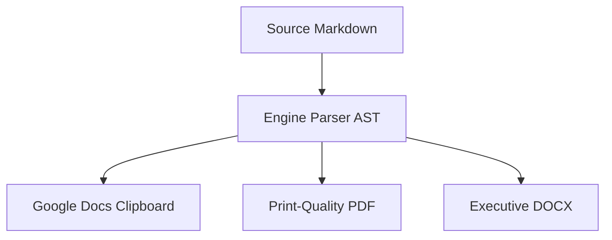

# Executive Summary

This strategic document outlines our engineering roadmap, cloud architecture milestones, and developer productivity enhancements[^1]. Designed to be converted directly into an executive **Google Docs** report, preserving typographic harmony, table formatting, callouts, and syntax highlighting.

> [!NOTE]
> All specifications in this document adhere strictly to the highest industrial enterprise standards[^arch-study].

---

# Table of Contents

[TOC]

---

<!-- pagebreak -->

# Architecture Pillars



The modern cloud stack is structured around four primary pillars:

1. **Deterministic Builds**: Completely reproducible artifacts across local and CI/CD environments.
2. **Sub-second Response Times**: Global edge caching and optimal database query indexing.
3. **Automated Documentation**: Converting Markdown specifications directly to styled Google Docs.
4. **Resilient Security Posture**: OAuth 2.0 PKCE authentication with encrypted OS-level token caching.

### Key Technical Definitions

AST Engine
: Abstract Syntax Tree translating Markdown tokens into inline CSS styles.

Native Bookmarks
: Google Docs named anchors enabling bidirectional Table of Contents jumping.

> [!TIP] Pro Tip
> Use the **"Copy for Google Docs"** command (`Ctrl+Shift+P` -> `Copy for Google Docs`), then press <kbd>Ctrl</kbd> + <kbd>V</kbd> inside any Google Doc for 100% style fidelity!

---

# Extended Alert Admonitions

The converter natively formats 12 distinct callout alert types as Google Docs single-cell tables:

> [!INFO] Information
> Real-time streaming metrics are collected and aggregated via Google Cloud Pub/Sub.

> [!SUCCESS] Verification Complete
> Automated test suite passed with 18 of 18 checks verified.

> [!QUESTION] Need Guidance?
> Refer to the internal Developer Portal FAQ or reach out to `#platform-engineering`.

> [!TODO] Action Item
> Complete load testing on secondary staging cluster before Friday.

> [!EXAMPLE] Usage Example
> Example command line execution: `npm test` runs all unit tests.

> [!WARNING] Token Expiration
> Expired tokens must be refreshed automatically before executing batch upload operations.

> [!DANGER] Critical Failure Safeguard
> Automatic circuit breakers will trip if downstream failure exceeds 5% within a 60-second window.

---

# Advanced Typography & Formatting

- **Inline Text Highlighting**: Critical security alerts require ==immediate operator attention==.
- **Subscript & Superscript**: Chemical notation $H_2O$ is written as H~2~O, while exponential scaling is $2^{32}$ written as 2^32^.
- **Editorial Insertions**: Deprecated APIs were replaced with ++modern REST endpoints++.
- **Keyboard Shortcuts**: Press <kbd>Ctrl</kbd> + <kbd>Shift</kbd> + <kbd>P</kbd> to open the Command Palette.

---

# System Benchmark & Latency Analysis

The following table summarizes response times and throughput under peak load:

| Service Component | Environment | P95 Latency | P99 Latency | Availability | Status |
| :--- | :---: | :---: | :---: | :---: | ---: |
| Authentication Gateway | Global Edge | 14ms | 28ms | 99.99% | **Active** |
| Data Processing Engine | US-Central | 42ms | 68ms | 99.95% | **Active** |
| Document Sync Worker | Multi-Region | 85ms | 120ms | 99.98% | **Active** |
| Backup Storage Vault | Cold Storage | 240ms | 410ms | 99.99% | **Standby** |

> [!IMPORTANT]
> Ensure all database migration scripts are executed in staging before triggering production deployment.

---

# Implementation Code

Below is the core implementation for multipart file streaming to the Google Drive API:

```typescript
import { GoogleDriveClient, DriveUploadResult } from './google/googleDriveClient';

async function syncMarkdownDocument(title: string, htmlContent: string, token: string): Promise<DriveUploadResult> {
  // Direct conversion to native Google Doc format
  const result = await GoogleDriveClient.uploadToGoogleDocs({
    title,
    htmlContent,
    accessToken: token
  });

  console.log(`Document created successfully at: ${result.editUrl}`);
  return result;
}
```

And in Python for automated report generation:

```python
import requests

def upload_gdoc(title: str, html_payload: str, token: str) -> str:
    """Uploads styled HTML directly to Google Drive as a native Google Doc."""
    headers = {"Authorization": f"Bearer {token}"}
    files = {
        'data': ('metadata', '{"name": "' + title + '", "mimeType": "application/vnd.google-apps.document"}', 'application/json'),
        'file': ('content.html', html_payload, 'text/html')
    }
    response = requests.post("https://www.googleapis.com/upload/drive/v3/files?uploadType=multipart", headers=headers, files=files)
    return response.json().get("id")
```

Inline code elements like `const token = await auth.getToken();` and `google.drive.v3` are formatted with crisp borders and tinted backgrounds.

---

# Mathematical Calculations

Mass-energy equivalence is computed via $E = mc^2$, and the standard quadratic optimization function is expressed as:

$$
x = \frac{-b \pm \sqrt{b^2 - 4ac}}{2a}
$$

---

# Action Checklist

- [x] Complete Markdown Parser AST with inline style translation
- [x] Implement 5 Curated Professional Themes (Modern Slate, Executive Navy, Emerald, Crimson, Tech Violet)
- [x] Build Google Drive API multipart upload with native `vnd.google-apps.document` conversion
- [x] Support 1-Click zero-config Rich Clipboard copy (<kbd>Ctrl</kbd> + <kbd>V</kbd> into Google Docs)
- [x] Build Live Side-by-Side Google Docs Preview Webview with smooth anchor jumping
- [x] Provide local HTML and DOCX export capabilities
- [x] Implement native `<a name="...">` bookmarks for Table of Contents & Cross-References
- [x] Support manual `[TOC]` placement and configurable `toc_depth`
- [x] Support Footnotes citations with bidirectional links
- [x] Extended callout admonitions (12 types)
- [ ] Conduct final user walkthrough

---

[Back to Top](#top)

---

[^1]: Enterprise Cloud Architecture Guidelines, Technical Report Series, 2026.
[^arch-study]: Global High-Availability Benchmark Study, Platform Reliability Working Group.
